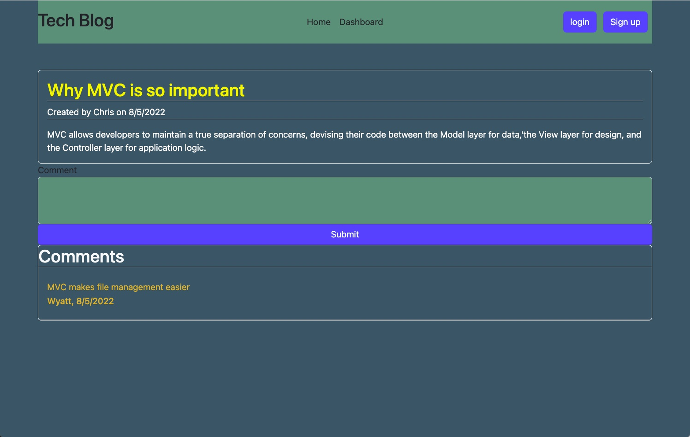

# tech-blog

### Description
With is project I was tasked with creating a CMS-style blog site.  This will allow users to publish articles, blog posts and their thoughts and opinions.

### Things I included in this project
1. When the user visits the site for the first time, they will be presented with a homepage tha includes existing blog posts if any have been posted. Navigation links for the homepage and dashboard, and the option to login.
2. When users click the homepage they are taken to the homepage.
3. When users click any other link they are prompted to either sign up or login.
4. When the user chooses sign up they are prompted to create a username and password.
5. When the signup button is pressed after entering a username and password then the user credentials are saved and the user is logged in.
6. When the user revisits the site at a later time and choose to sign in they are prompted to enter a username and password.
7. After the user is signed in they will see links to homepage dashboard and login is now logout.
8. If the user clicks on the homepage link they are taken to the homepage and presented with existing blog post and the post title and the date created.
9. If the user clicks on a blog post they will be presented with the post title, contents, post creator's name, the date of the post, and an option to leave a comment.
10. When the user enters a comment and submit button while signed in, the comment is saved and the post is updated to display the comment, the comment's creator's name, and the date created.
11. If the user clicked on the dashboard link, they will be taken to the dashboard page.  They will be presented any blog posts they have created and the option to add a new blog post.
12. When the user is clicks on the button to add a new blog post, they will be prompted to enter both a title and contents for the blog post.
13. After filling out the title and contents of the new post and clicking on the button to submit. The users post will be saved and then taken back to the dashboard that is updated with the new post.
14. When the user clicks on one of the existing post, they are able to delete or update the post. then be taken back to the updated dashboard.
15. When the user clicks on the logout option in the navigation, they will be signed out of the site.
16. After being idle on the site for a set time. The user is asked to log in again before they came add, update, or delete comments.

[tech-blog](https://github.com/cefaust/tech-blog) 

